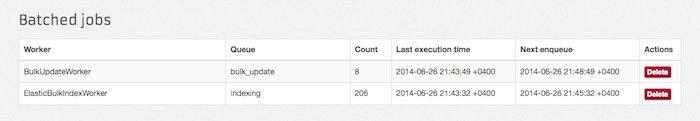

# Sidekiq::Grouping

<a href="https://evilmartians.com/?utm_source=sidekiq-grouping-gem">

</a>

Allows to combine similar sidekiq jobs into groups to process them at once.

Useful for:
* Grouping asynchronous API index calls into bulks for bulk updating/indexing.
* Periodical batch updating of recently changing database counters.

*NOTE:* As of 1.0 `batch_size` renamed to `batch_flush_size`.
*NOTE:* As of 1.0.6 works with Sidekiq 4.
*NOTE:* As of 1.0.8 Locking is atomic (set nx/ex) and will no longer lead to batches that are permalocked and stuck

## Usage

Create a worker:

```ruby
class ElasticBulkIndexWorker
  include Sidekiq::Worker

  sidekiq_options(
    queue: :elasic_bulks,
    batch_flush_size: 30,     # Jobs will be combined when queue size exceeds 30
    batch_flush_interval: 60, # Jobs will be combined every 60 seconds
    retry: 5
  )

  def perform(group)
    client = Elasticsearch::Client.new
    client.bulk(body: group.flatten)
  end
end
```

Perform a jobs:

```ruby
# At least 30 times

ElasticBulkIndexWorker.perform_async({ delete: { _index: 'test', _id: 5, _type: 'user' } })
ElasticBulkIndexWorker.perform_async({ delete: { _index: 'test', _id: 6, _type: 'user' } })
ElasticBulkIndexWorker.perform_async({ delete: { _index: 'test', _id: 7, _type: 'user' } })
...
```

This jobs will be grouped into the single job with the single argument:

```ruby
[
  [{ delete: { _index: 'test', _id: 5, _type: 'user' } }],
  [{ delete: { _index: 'test', _id: 6, _type: 'user' } }],
  [{ delete: { _index: 'test', _id: 7, _type: 'user' } }]
  ...
]
```

## Control grouping

- If `batch_flush_size` option is set - grouping will be performed when batched queue size exceeds this value or `Sidekiq::Grouping::Config.max_batch_size` (1000 by default).
- If `batch_flush_interval` option is set - grouping will be performed every given interval.
- If both are set - grouping will be performed when first condition become true. For example, if `batch_flush_interval` is set to 60 seconds and `batch_flush_size` is set to 5 - group task will be enqueued even if just 3 jobs are in the queue at the end of the minute. In the other hand, if 5 jobs were enqueued during 10 seconds - they will be grouped and enqueued immediately.

## Options

- `batch_unique` prevents enqueue of jobs with identical arguments.

  ```ruby
  class FooWorker
    include Sidekiq::Worker

    sidekiq_options batch_flush_interval: 10, batch_unique: true

    def perform(n)
      puts n
    end
  end

  FooWorker.perform_async(1)
  FooWorker.perform_async(1)
  FooWorker.perform_async(2)
  FooWorker.perform_async(2)

  # => [[1], [2]]
  ```

- `batch_size` is used to control single group size.

  ```ruby
  class FooWorker
    include Sidekiq::Worker

    sidekiq_options batch_flush_size: 5, batch_size: 2

    def perform(n)
      puts n
    end
  end

  FooWorker.perform_async(1)
  FooWorker.perform_async(2)
  FooWorker.perform_async(3)
  FooWorker.perform_async(4)
  FooWorker.perform_async(5)

  # => [[1], [2]]
  # => [[3], [4]]
  # => [[5]]
  ```

## Web UI



Add this line to your `config/routes.rb` to activate web UI:

```ruby
require "sidekiq/grouping/web"
```

## Configuration

```ruby
Sidekiq::Grouping::Config.poll_interval = 5     # Amount of time between polling batches
Sidekiq::Grouping::Config.max_batch_size = 5000 # Maximum batch size allowed
Sidekiq::Grouping::Config.lock_ttl = 1          # Batch queue flush lock timeout job enqueues
```

## TODO

1. Add support redis_pool option.

## Installation

Add this line to your application's Gemfile:

    gem 'sidekiq-grouping'

And then execute:

    $ bundle

Or install it yourself as:

    $ gem install sidekiq-grouping

## Contributing

1. Fork it ( http://github.com/gzigzigzeo/sidekiq-grouping/fork )
2. Create your feature branch (`git checkout -b my-new-feature`)
3. Commit your changes (`git commit -am 'Add some feature'`)
4. Push to the branch (`git push origin my-new-feature`)
5. Create new Pull Request
